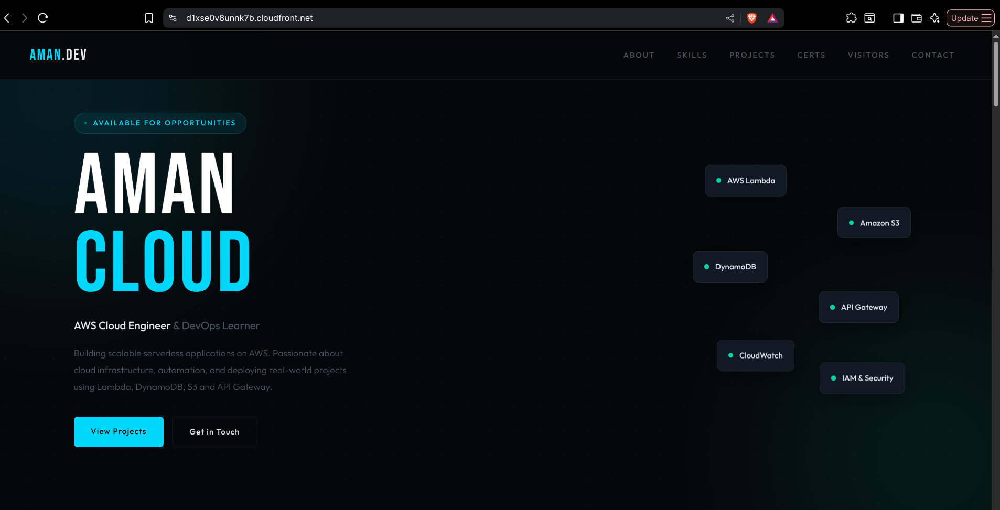
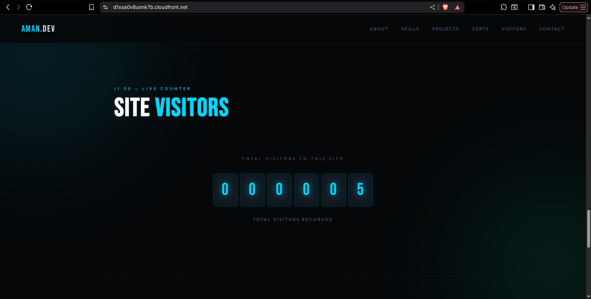
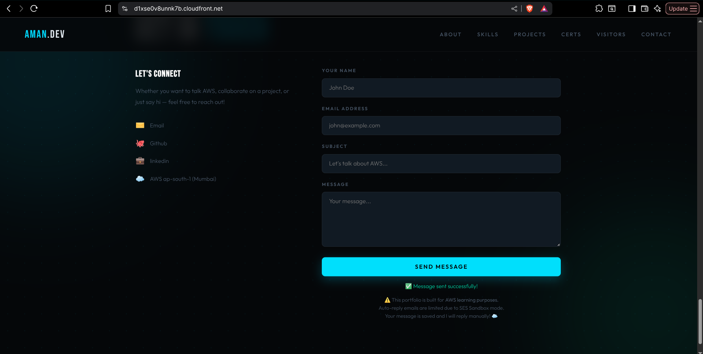
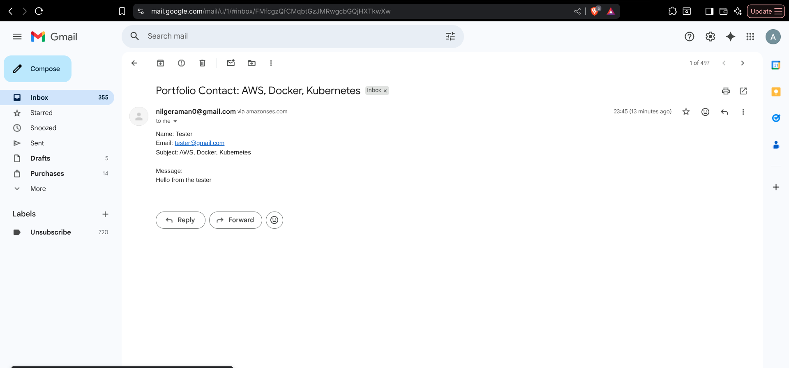
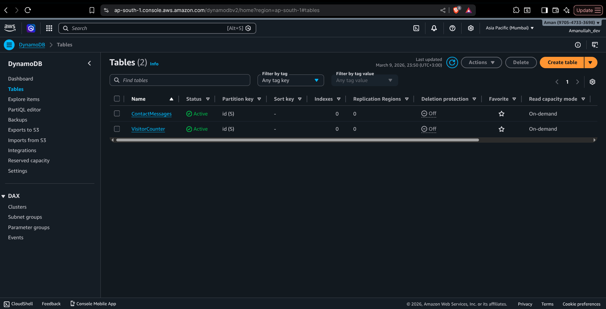
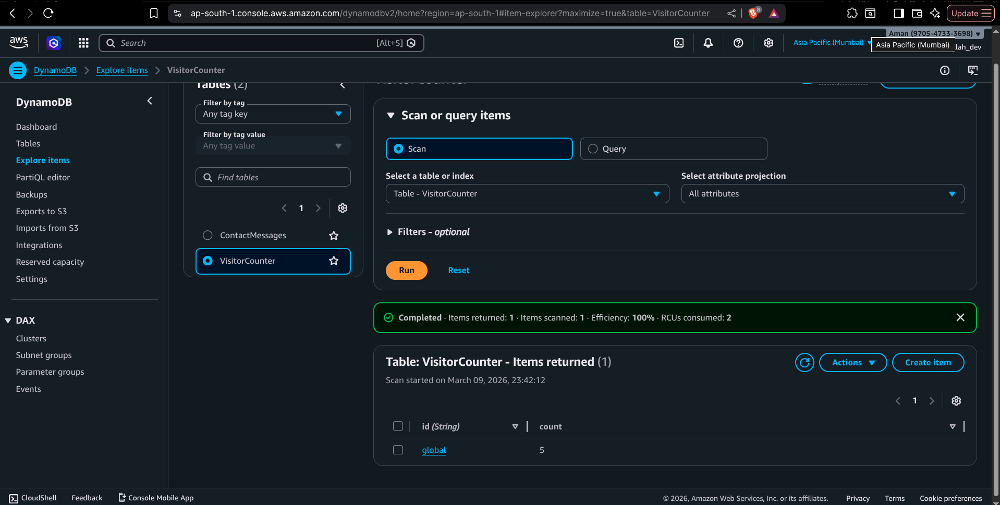
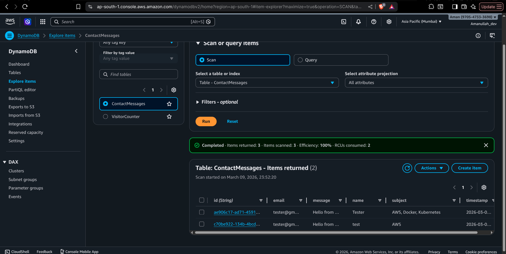
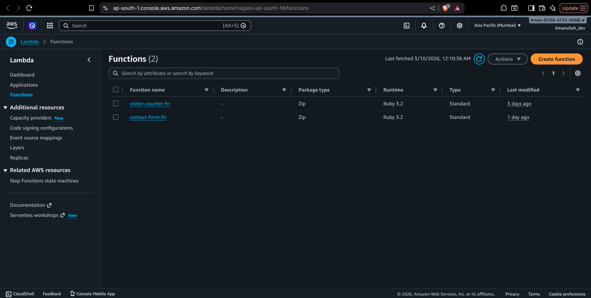

# 🚀 AWS Serverless Portfolio

A fully serverless portfolio website built and deployed on AWS using 8 services.
Live and running on **AWS ap-south-1 (Mumbai)** region.

🌐 **Live Demo:** https://d1xse0v8unnk7b.cloudfront.net

---

## 📸 Screenshots

> Portfolio Homepage


> Visitor Counter Working


> Sending Message 


> Contact Form Working


> Recived Email From User 


> DynamoDB Tables


> DynamoDB VisitorCounter Table


> DynamoDB ContactMessage Table


> Lambda functions



---

## 🏗️ Architecture

```
Users Worldwide
      ↓
CloudFront (HTTPS + Global CDN)
      ↓
S3 (Static Website Hosting)
      ↓
API Gateway (HTTP API)
     ↙              ↘
Lambda              Lambda
(visitor-counter)   (contact-form)
     ↓                ↓         ↘
DynamoDB          DynamoDB      SES
(VisitorCounter)  (ContactMessages) (Email Notification)
```

---

## ☁️ AWS Services Used

| Service | Purpose |
|---|---|
| **Amazon S3** | Hosts the static portfolio website |
| **AWS Lambda** | Serverless backend functions (Ruby 3.2) |
| **Amazon DynamoDB** | Stores visitor count + contact messages |
| **API Gateway** | Exposes Lambda as REST API endpoints |
| **Amazon SES** | Sends contact form emails + auto-replies |
| **AWS IAM** | Manages roles and permissions |
| **Amazon CloudWatch** | Monitors logs and function errors |
| **Amazon CloudFront** | HTTPS + global content delivery |

---

## ⚡ Features

- 🔢 **Live Visitor Counter** — tracks every unique visitor in real time
- 📧 **Contact Form** — saves messages to DynamoDB + sends email notification
- 🌍 **Global CDN** — CloudFront delivers content fast worldwide
- 🔒 **HTTPS** — secured via CloudFront SSL certificate
- 📱 **Responsive Design** — works on all devices
- ✨ **Scroll Animations** — smooth reveal animations on scroll

---

## 📁 Project Structure

```
aws-serverless-portfolio/
│
├── index.html                  # Portfolio website (S3)
│
├── lambda/
│   ├── visitor_counter.rb      # Visitor counter Lambda (Ruby)
│   └── contact_form.rb         # Contact form Lambda (Ruby)
│
├── screenshots/
│   ├── portfolio.png
│   ├── counter.png
│   └── dynamodb.png
│
└── README.md
```

---

## 🗄️ DynamoDB Tables

### Table 1 — VisitorCounter
| Attribute | Type | Description |
|---|---|---|
| `id` | String (PK) | Fixed value: `global` |
| `count` | Number | Total visitor count |

### Table 2 — ContactMessages
| Attribute | Type | Description |
|---|---|---|
| `id` | String (PK) | UUID (auto-generated) |
| `name` | String | Sender name |
| `email` | String | Sender email |
| `subject` | String | Message subject |
| `message` | String | Message body |
| `timestamp` | String | ISO 8601 timestamp |

---

## 🔗 API Endpoints

| Method | Endpoint | Description |
|---|---|---|
| `GET` | `/prod/visitor` | Get current visitor count |
| `POST` | `/prod/visitor` | Increment visitor count |
| `POST` | `/prod/contact` | Submit contact form |

---

## 💻 Lambda Functions

### visitor_counter.rb
```ruby
# GET  → Read visitor count from DynamoDB
# POST → Increment visitor count by 1
```

### contact_form.rb
```ruby
# POST → Save message to DynamoDB
#      → Send notification email via SES
#      → Send auto-reply to user via SES
```

---

## 🚀 Deployment Steps

### 1. DynamoDB
- Create `VisitorCounter` table with partition key `id` (String)
- Create `ContactMessages` table with partition key `id` (String)

### 2. Lambda
- Create `visitor-counter-fn` with Ruby 3.2 runtime
- Create `contact-form-fn` with Ruby 3.2 runtime
- Attach `AmazonDynamoDBFullAccess` to both functions
- Attach `AmazonSESFullAccess` to contact-form-fn

### 3. API Gateway
- Create HTTP API `portfolio-api`
- Add routes: `GET /visitor`, `POST /visitor`, `POST /contact`
- Configure CORS: Allow origin `*`, headers `Content-Type`
- Deploy to `prod` stage

### 4. SES
- Verify sender email address in ap-south-1
- Update Lambda with verified email

### 5. S3
- Create bucket `aman-porfolio-2026`
- Disable block public access
- Enable static website hosting
- Add public bucket policy
- Upload `index.html`

### 6. CloudFront
- Create distribution pointing to S3 website endpoint
- Set viewer protocol to `Redirect HTTP to HTTPS`
- Set default root object to `index.html`

---

## 💰 AWS Cost Estimate

| Service | Free Tier | Estimated Cost |
|---|---|---|
| Lambda | 1M requests/month free | ~$0.00 |
| DynamoDB | 25GB always free | ~$0.00 |
| SES | 62K emails/month free | ~$0.00 |
| S3 | 5GB / 12 months | ~$0.001/day |
| API Gateway | 1M requests / 12 months | ~$0.01/day |
| CloudFront | 1TB / 12 months | ~$0.01/day |

**Total: ~$0.50/month for low traffic** 💰

---

## 🔒 Security

- IAM roles follow **least privilege** principle
- CORS configured to allow only required origins
- No hardcoded credentials in code
- Environment variables used for sensitive config

---

## 📚 What I Learned

- How to connect multiple AWS services together
- Debugging real CORS errors in API Gateway
- IAM roles and permission management
- Serverless architecture design patterns
- CloudFront CDN setup and cache invalidation
- SES email integration with Lambda
- DynamoDB atomic counter operations
- Ruby Lambda function development

---

## 👨‍💻 Author

**Aman** — AWS Cloud Learner & DevOps Enthusiast

- 🌐 Portfolio: https://d1xse0v8unnk7b.cloudfront.net
- 💼 LinkedIn: https://linkedin.com/in/yourname
- ☁️ AWS Region: ap-south-1 (Mumbai)

---

## 📜 License

This project is open source and available under the [MIT License](LICENSE).

---

⭐ **If you found this helpful, please give it a star!**
